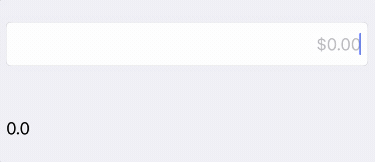

# DoubleInputFormatter
This is a simple `UITextFieldDelegate` that allows easy formatting of localized currency or numerical inputs to string, whilst making it easy to still access the underlying value in the form of a `Double`.




## How to use
To get started it's super simple.

1. Create an instance of the `DoubleInputFormatterTextDelegate` passing in your `UITextField`.
```
/// UITextField as required by component
lazy var bodyTextField: UITextField = {
    ...
}()

/// The formatter for our `UITextField`
lazy var textFieldFormatter: DoubleInputFormatterTextDelegate = {
    
    let textFieldFormatter = DoubleInputFormatterTextDelegate(
        field: bodyTextField
    )
    
    return textFieldFormatter
}()
```

2. Listen for changes to the underlying value 
```
textFieldFormatter.valueForInput = { value in
    print("\(value)")
}
```


## Customisation
### Formatter
You can provide your own `NumberFormatter` and override the default currency one to have fine grained control over what's displayed.

### Placeholder 
A placeholder is only set when the `UITextField`'s `textAlignment` property is set to `.right`. When set to `.left` the cursor sits in an odd location. Open to feedback on alternative approaches.

## Demo App
Pleas reference the demo app that shows how to use this simple class in your own projects.


## Test
Test's have been added to cover a myriad of use cases. Delegate and Target/Action pattern are not tested, but the internal logic of the transformation is. 

